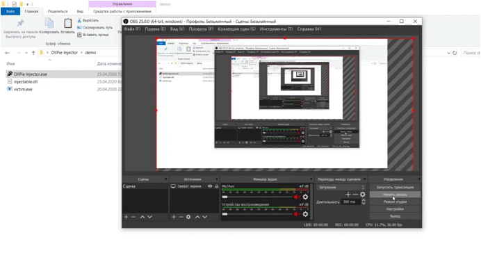

# DllPie Injector
My first attempt to implement dll injection

## Features
- LoadLibraryA injection method

## Demonstration
##### victim.exe:
```
#include <iostream>
#include <chrono>
#include <thread>

int main() {
	for (int i = 0; i < 100; i++) {
		std::cout << "Hello!" << std::endl;
		std::this_thread::sleep_for(std::chrono::milliseconds(1000));
	}
	return 0;
}
```

##### injectable.dll
```
#include <Windows.h>
#include "pch.h"
#include <stdio.h>

BOOL APIENTRY DllMain(HINSTANCE hinstDLL, DWORD fdwReason, LPVOID lpvReserved) {
	if (fdwReason == DLL_PROCESS_ATTACH) {
		printf("INJECTED!\n");
	}
	return TRUE;
}
```
#### demonstration
